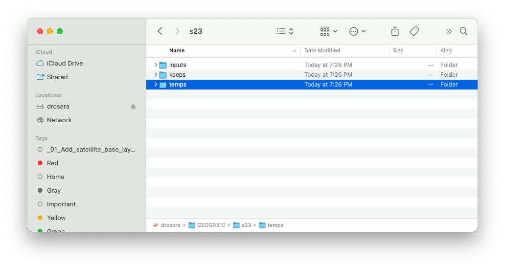

## VT Conservation    

A collection of geographic data workflows for teaching and doing conservation planning using examples from Vermont, USA.   

### Data 

To access data called by the scripts:

1. Create three directories in a root directory on a drive as shown below. The three directories should be named:
    * inputs
    * keeps
    * temps

 

2. Download the required datasets from [here][data] and place them in the inputs folder.

3. In the practice script, uppdate your root directory path so that it points to your root folder. For example:  

```python
root = "/Volumes/drosera/GEOG0310/s23"
```

### Practice workflows

The practice workflows are python scripts that implement [WhiteboxTools Open Core][wb1]. For technical documentation, please refer to the [WhiteboxTools manual][wb2].

| Script    | Description   |
| :--       | :---          |
| [_01_simple_landforms.py][01] | Classify landforms from a 10m DEM with geomorphons. | 
| [_02_valley_bottoms.py][02]   | Classify landforms with geomorphons, threshold to isolate valley bottoms, smooth with neighborhood majority filter. | 

### Contact 

Jeff Howarth  
Associate Professor of Geography  
Middlebury College  


[data]: https://drive.google.com/drive/folders/1H_9ShSYgT1qYIMOfpEarzISFqd3OnGSu?usp=sharing

[wb1]: https://www.whiteboxgeo.com/geospatial-software/

[wb2]: https://www.whiteboxgeo.com/manual/wbt_book/available_tools/index.html

[01]: practice/_01_simple_landforms.py 
[02]: practice/_02_valley_bottoms.py


