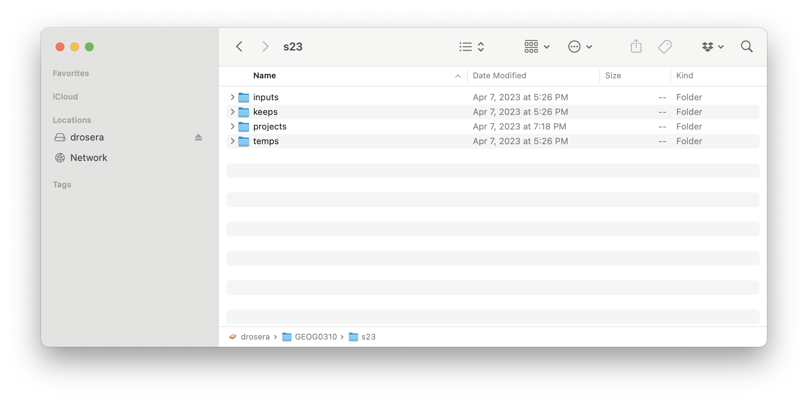
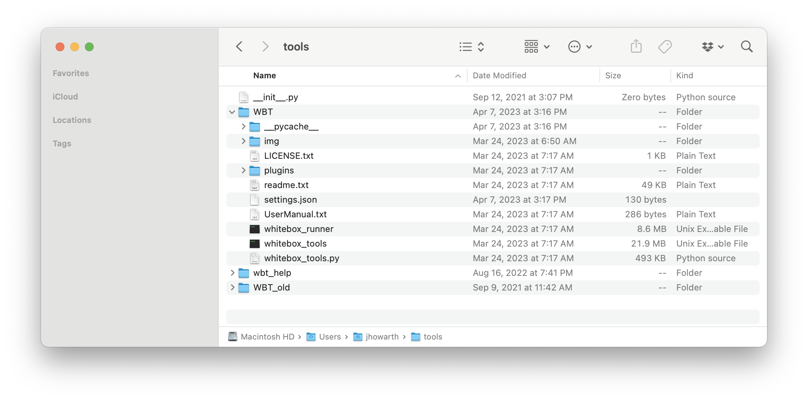

## VT Conservation    

A collection of geographic data workflows for teaching and doing conservation planning using examples from Vermont, USA.   

### Practice  

The practice scripts outline workflows that you can implement with python and [WhiteboxTools Open Core][wb1]. The idea is that you learn by trying to fill in the blanks. For technical documentation on WhiteboxTools, please refer to the [WhiteboxTools manual][wb2]. To check your work, please refer to the solution for each problem.  

| Practice    | Description   | Solution  |
| :--       | :---          | :---:      |
| [_01p_simple_landforms.py][01p] | Classify landforms with geomorphons. | [01][01s] |
| [_02p_valley_bottoms.py][02p]   | Classify landforms with geomorphons, threshold to isolate valley bottoms, smooth with neighborhood majority filter. |  [02][02s]
| [_03p_forest_habitat_blocks.py][03p] | Classify forest habitat blocks. | [03][03s]
| [_04p_select_valley_corridors.py][04p] | Align images, erase constraints, select by topological criteria. | [04][04s]


### Data repository  

You can access data for the practice scripts [here][data].  

| Dataset   | Description   | 
| :---      | :---          |
| DEM_10m_midd.tif  | 10m 3DEP for Middlebury, Vermont.  |
| LCHP_1m_midd.tif  | 1m Vermont Land Cover dataset with agriculture, roads, and building zones for Middlebury, Vermont. | 

### Data directory structure

To use this data in the practice scripts, you will need to:  

1. Create four sub-directories in a parent directory on a local drive as shown in the picture below. The four directories should be named:

    * **inputs**: to store starting datasets
    * **keeps**: to store final outputs of a model
    * **projects**: to store qgis projects for viewing outputs
    * **temps**: to store intermediate outputs of the model that can be deleted after the model runs 

 

2. Download the required datasets and place them in the inputs folder.  

3. In the practice script, update the root variable so that it provides the path to your root folder. For example:  

```python
root = "/Volumes/drosera/GEOG0310/s23"
```

In the above example, the root variable points to the s23 folder in GEOG0310 on an external hardrive named drosera. 

### WBT path 

I like to keep my WBT directory separate from my data. I find that this makes it easier to update the WBT directory with new versions of the tools.



Most of the practice and solution scripts start with the code block shown below. This points to my local WBT directory.  

```python  
# import tools from WBT module

import sys
sys.path.insert(1, '/Users/jhowarth/tools')     # path points to my WBT directory
from WBT.whitebox_tools import WhiteboxTools

# declare a name for the tools

wbt = WhiteboxTools()
```

To run the scripts, you will need to update the path so that it points to the parent directory of your local WBT sub-directory.

### Contact 

Jeff Howarth  
Associate Professor of Geography  
Middlebury College  


[data]: https://drive.google.com/drive/folders/1H_9ShSYgT1qYIMOfpEarzISFqd3OnGSu?usp=sharing

[wb1]: https://www.whiteboxgeo.com/geospatial-software/

[wb2]: https://www.whiteboxgeo.com/manual/wbt_book/available_tools/index.html

[01p]: practice/_01p_simple_landforms.py 
[01s]: solutions/_01s_simple_landforms.py

[02p]: practice/_02p_valley_bottoms.py
[02s]: solutions/_02s_valley_bottoms.py

[03p]: practice/_03p_forest_habitat_blocks.py
[03s]: solutions/_03s_forest_habitat_blocks.py

[04p]: practice/_04p_select_valley_corridors.py
[04s]: solutions/_04s_select_valley_corridors.py